# Monocular vs. Stereo Visual Odometry Evaluation

This repository contains the source code, evaluation metrics, and trajectory analysis tools for a comparative study between Classical Monocular and Strict Keyframe-Interlock Stereo Visual Odometry pipelines, specifically evaluated against high-rotation, sparse-texture environments.

## 📁 Repository Structure

This repository contains two main folders:

* **Pipeline-I**
* **Pipeline-II**

### Pipeline-I: KLT Tracking

Pipeline-I implements visual odometry using KLT feature tracking. The folder is organized into two main sub-directories: `code/` and `results/`.

#### 1. `code/`

The `code/` directory contains the execution and evaluation scripts for each dataset.

~~~
code/
├── room2/
├── corridor3/
└── outdoors5/
~~~
Each folder contains the execution scripts and evaluation code for the corresponding dataset.
#### 2. `Results/`
The results/ directory stores the outputs generated by Pipeline-I. Results are organized by dataset and by visual odometry configuration, including both Monocular VO and Stereo VO.

### Pipeline-II: ORB-Based Visual Odometry

Pipeline-II implements visual odometry using ORB features for both monocular and stereo configurations.
~~~
Pipeline II_ORB/
├── ORB_Outputs/      # Generated outputs and logs
├── results_png/      # Saved trajectory images and evaluation figures
├── scripts/          # Execution, evaluation, and testing scripts
└── src/              # Core modular implementation
~~~

## Dataset Configuration

Due to size limitations (approximately 15GB combined), the raw image sequences and sensor data are not included in this repository. To execute the pipelines, you must download the datasets and place them in the correct relative locations.

**1. Download the Dataset**
Download the required sequence (e.g., `dataset-outdoors5_512_16` or `dataset-room2_512_16`) from the official TUM VI dataset provider.

**2. Place in the Root Directory**
Create a root-level directory named `dataset/` and extract your downloaded sequences into it. Ensure the extracted folders match the naming conventions expected by the scripts.

## 📦 Dependencies & Packages

The project is built using a clean, standard Python configuration optimized for fast numerical execution on edge devices:

* **Python 3.x**
* **OpenCV (`opencv-python`):** Used for lens distortion mapping, Shi-Tomasi corner extraction, LK optical flow tracking, and initial EPnP RANSAC pose estimation.
* **SciPy (`scipy.optimize`):** Utilizes `least_squares` with robust loss configurations to handle non-linear pose refinement, local bundle adjustment, and Huber-loss optimization loops.
* **NumPy:** Handles underlying matrix operations, frame transformations, vector operations, and coordinate projections.
* **Matplotlib:** (Optional) For real-time 2D/3D trajectory plotting and error evaluation tracking.

## 🛠️ Pipeline Architecture
## Pipeline-I: KLT Tracking
The proposed framework evaluates two visual odometry paradigms: a baseline Monocular VO pipeline and a Mono-Extended Stereo VO pipeline with metric-scale correction.
### 1. Monocular VO Backbone (Stage 1)

The baseline pipeline extracts undistorted pinhole features and establishes frame-to-frame temporal correspondences.

  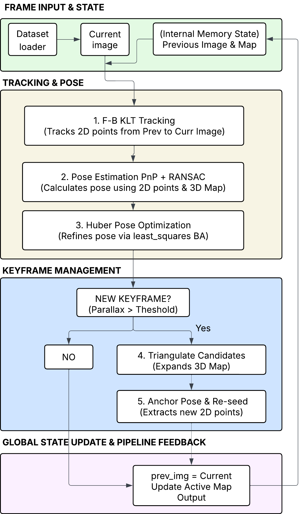

The monocular backbone performs sparse feature tracking using the Pyramidal Lucas–Kanade (KLT) optical flow framework. Shi–Tomasi corners are extracted and refined to sub-pixel accuracy before temporal tracking.

To improve tracking reliability:

* Forward–backward optical flow verification removes inconsistent correspondences.
* Border filtering rejects unstable edge features.
* EPnP + RANSAC pose estimation computes the relative camera transformation.
* Triangulated landmarks are validated using reprojection error and positive depth constraints.

Keyframes are inserted dynamically using parallax magnitude and feature depletion thresholds. A 4×4 grid bucketing strategy maintains uniform spatial feature distribution across the image plane.

------

### 2. Mono-Extended Stereo & Metric Correction (Stages 2 & 3)

  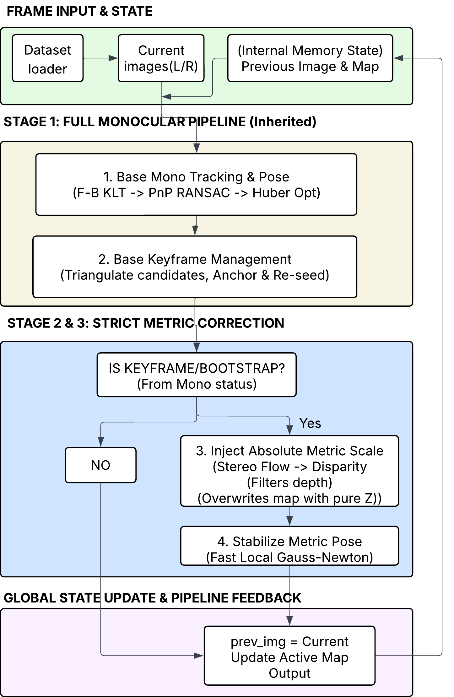

When a keyframe is triggered by parallax thresholds, the right stereo frame is read to calculate horizontal disparity and inject absolute metric scale into the global map.
For every selected keyframe:

* Left-right stereo correspondences are computed using KLT tracking.
* Horizontal disparity is converted into metric depth using the stereo pinhole model:

$$
Z = \frac{fb}{d}
$$

where:

* \(f\) = focal length  
* \(b\) = stereo baseline  
* \(d\) = disparity

Recovered 3D landmarks overwrite the scale-ambiguous monocular map, eliminating scale drift accumulation.

A lightweight local optimization stage using `scipy.optimize.least_squares()` further refines the pose by minimizing reprojection residuals under robust Huber-loss constraints.

------

## Pipeline-II: ORB-Based Visual Odometry 
### 1. Monocular VO Backbone

The monocular pipeline estimates camera motion using only the left camera image stream. Since only one camera is used, the trajectory is scale-ambiguous and requires Sim(3) alignment during evaluation.

  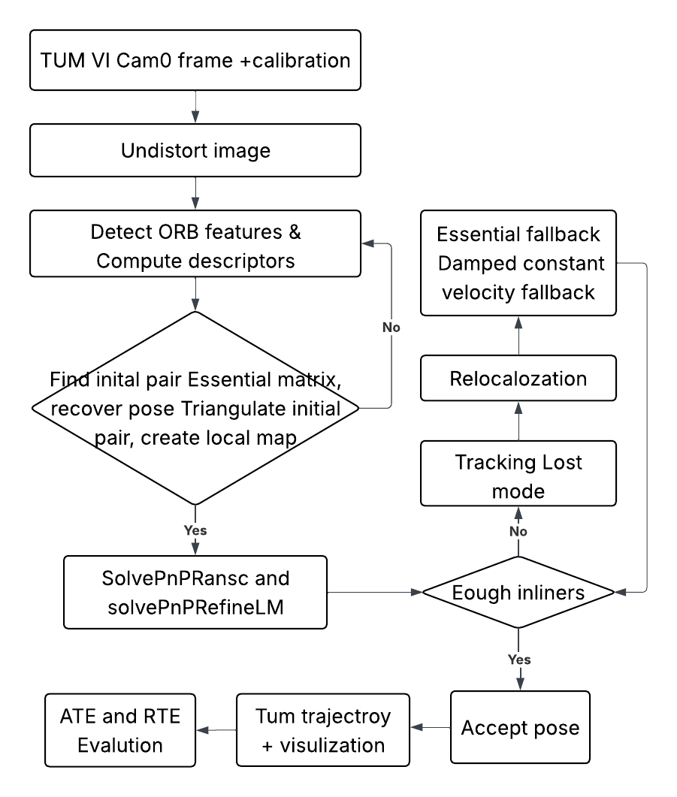

The monocular system first undistorts the fisheye image using the TUM VI calibration file. ORB features are then detected and matched between frames using Hamming-distance descriptor matching.

Initialization is performed from a carefully selected image pair:

* ORB features are detected in both frames.
* Feature matches are filtered using Lowe’s ratio test and mutual checking.
* The Essential Matrix is estimated using RANSAC.
* Relative pose is recovered using `recoverPose()`.
* Initial 3D landmarks are created by triangulation.
* Landmarks are validated using positive depth, reprojection error, and parallax checks.

After initialization, the system tracks each new frame using 3D–2D pose estimation:

* Existing 3D map points are matched with current ORB features.
* Camera pose is estimated using `solvePnPRansac()`.
* The actual PnP type used is `SOLVEPNP_ITERATIVE`.
* The pose is refined using `solvePnPRefineLM()`.
* Reprojection error and motion sanity checks validate the pose.

If tracking becomes weak, the system uses recovery mechanisms:

* Local and global relocalization against stored map points.
* Essential Matrix fallback using recent frame-to-frame geometry.
* Damped constant-velocity fallback for short tracking gaps.
* Map rebuild from a strong anchor frame when the local map becomes unreliable.

Keyframes are inserted when motion, rotation, or weak tracking indicates that the map should be refreshed. New landmarks are triangulated from keyframe pairs and added to the local map.

---

### 2. Stereo VO Backbone

The stereo pipeline extends the monocular idea by using both left and right TUM VI camera images. Unlike monocular VO, stereo VO can recover metric depth directly from the stereo baseline.

  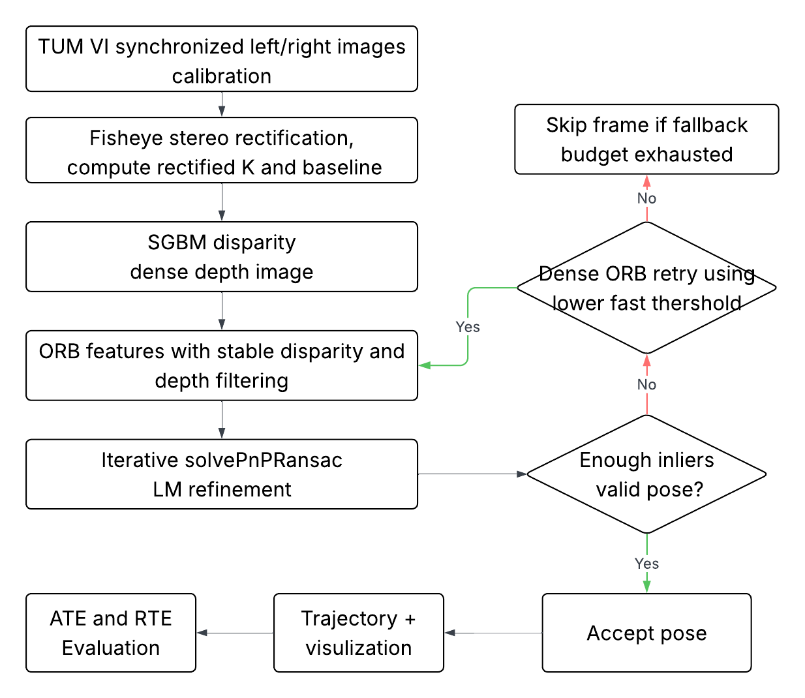

The stereo system first rectifies the left and right fisheye images using the camera calibration and stereo extrinsics. After rectification, horizontal disparity is computed using SGBM.

Metric depth is recovered using the stereo pinhole model:

$$
Z = \frac{fb}{d}
$$

where:

* \(f\) = rectified focal length  
* \(b\) = stereo baseline  
* \(d\) = horizontal disparity  

The stereo frontend works by combining ORB features with SGBM depth:

* SGBM computes disparity for the rectified stereo pair.
* ORB detects trackable features in the left image.
* Only ORB features with valid and stable disparity are kept.
* Each retained feature receives a metric 3D position.

Temporal tracking is then performed between consecutive stereo frames:

* ORB descriptors are matched from the previous frame to the current frame.
* Previous-frame 3D points are matched to current-frame 2D keypoints.
* Pose is estimated using `solvePnPRansac()`.
* The actual PnP type used is `SOLVEPNP_ITERATIVE`.
* The pose is refined using `solvePnPRefineLM()`.

To improve robustness, the stereo pipeline includes several fallback stages:

* Dense ORB retry with a lower FAST threshold when too few valid depth features exist.
* Loose retry with relaxed matching and PnP constraints.
* 3D–3D RANSAC rigid alignment when PnP fails but both frames have valid depth.
* Damped constant-velocity fallback for short gaps.

Because metric depth is available from the stereo baseline, the stereo trajectory does not suffer from monocular scale ambiguity. Evaluation therefore uses rigid SE(3) alignment instead of Sim(3) scale correction.

---

## **Monocular to Stereo Connection in Pipeline II**

The stereo pipeline builds directly on the monocular VO structure. Both mono and stereo use ORB features, descriptor matching, RANSAC pose estimation, pose refinement, validation checks, visualization, and trajectory evaluation.

The main difference is depth source:

* Monocular VO creates depth by triangulating motion between frames.
* Stereo VO creates depth immediately from left-right disparity.

This makes stereo more stable because scale is known from the beginning. The stereo baseline provides metric depth, reducing drift and improving recovery when tracking becomes difficult.

## 📊 Results and Discussion

* The pipelines were evaluated on Room2, Corridor3, and Outdoor5 sequences from the TUM-VI benchmark.

* Monocular VO achieved efficient real-time tracking but accumulated noticeable scale drift in long-range and low-texture environments.

* The stereo framework improved trajectory stability by injecting metric depth during keyframe updates.

* Stereo VO significantly reduced tracking failures, reprojection error, and long-term drift across all datasets.

* The largest improvement was observed in Outdoor5, where stereo depth correction stabilized large-scale trajectory estimation.

* Despite additional disparity computation, the stereo pipeline maintained real-time performance.

## 📈 Quantitative Evaluation

<table width="100%">
  
  <tr>
    <td>
 Pipeline-I Mono VO evaluation metrices on all datasets.

| Evaluation Metric | Room2 | Corridor3 | Outdoor5 |
|------------------|-------|------------|-----------|
| Absolute Trajectory Error (ATE) | 0.8696 m | N/A | N/A |
| Relative Pose Error (RPE) | 0.0789 m/frame | N/A | N/A |
| Start-to-End Drift (e_drift) | 0.5130 m | 0.5791 m | 0.50 m |
| Drift Percentage | 0.36 % | 1.42 % | 0.39 % |
| Tracking Failures (Recoveries) | 169 | 452 | 157 |
| Tracking Success Rate | 94.14 % | N/A | N/A |
| Mean Reprojection Error | 1.203 px | 2.059 px | 1.290 px |
| Mean Per-Frame Runtime | 41.25 Hz | 32.65 Hz | 25.79 Hz |
</td>
  <td>
Pipeline-I Stereo VO evaluation metrices on all datasets.

  | Evaluation Metric | Room2 | Corridor3 | Outdoors5 |
| :--- | :--- | :--- | :--- |
| Absolute Trajectory Error (ATE) | 0.2697m | N/A | N/A|
| Relative Pose Error (RPE) | 0.0181m | N/A |N/A |
| Start-to-End Drift (e_drift) | 0.4342 | 0.6617m | 30.099m |
| Drift Percentage | 0.31 | 1.63 | 23.52 |
| Tracking Failures | 0 | 0 | 1 |
| Tracking Success Rate | 100% | 100% | 99 |
| Mean Reprojection Error | 0.650 | 0.519 | 0.742 |
| Mean Per-Frame Runtime | 32.97 hz | 28. hz | 27.66 hz |
  </td>
  </tr>
</table>

<table width="100%">
  
  <tr>
    <td>
 Pipeline-II Mono VO evaluation metrices on all datasets.

| Evaluation Metric | Room2 | Corridor3 | Outdoor5 |
|------------------|-------|------------|-----------|
| Absolute Trajectory Error (ATE) | 1.255 m | N/A | N/A |
| Relative Pose Error (RPE) | 0.605 m/frame | N/A | N/A |
| Start-to-End Drift (e_drift) | 0.902 m | 1.515 m | 2.272 m |
| Tracking Failures (Recoveries) | 3 | 1 | 5 |
| Mean Reprojection Error | 1.170 px | 1.178 px | 1.171 px |
| Mean Per-Frame Runtime | 9.98 Hz | 10.63 Hz | 5.59 Hz |
</td>
  <td>

    
Pipeline-II Stereo VO evaluation metrices on all datasets.

  | Evaluation Metric | Room2 | Corridor3 | Outdoors5 |
| :--- | :--- | :--- | :--- |
| Absolute Trajectory Error (ATE) | 0.579 m | N/A | N/A|
| Relative Pose Error (RPE) | 0.232 m | N/A |N/A |
| Start-to-End Drift (e_drift) | 4.477 | 0.6617m | 48.67m |
| Tracking Failures | 0 | 0 | 2 |
| Tracking Success Rate | 100% | 100% | 95 |
| Mean Reprojection Error | 0.875 | 1.001 | 0.829 |
| Mean Per-Frame Runtime | 16.30 hz | 14.57 hz | 9.79 hz |
  </td>
  </tr>
</table>

## 🖼️ Trajectory Comparison

### Pipeline-I: KLT Tracking
| Dataset | Monocular VO | Stereo VO |
| :--- | :---: | :---: |
| **Room2** | 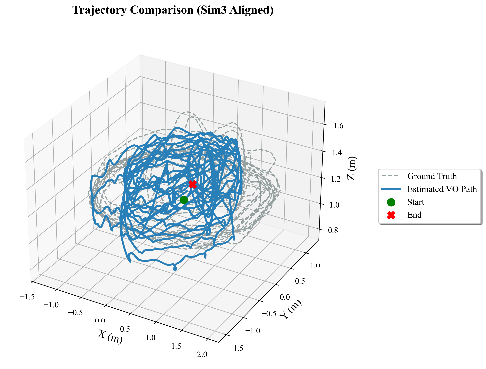 | 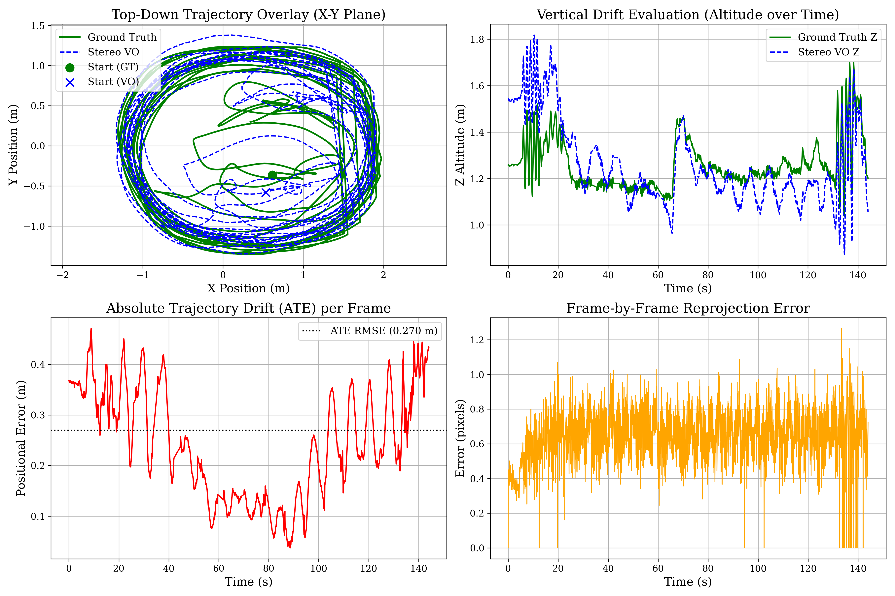 |
| **Corridor3** | 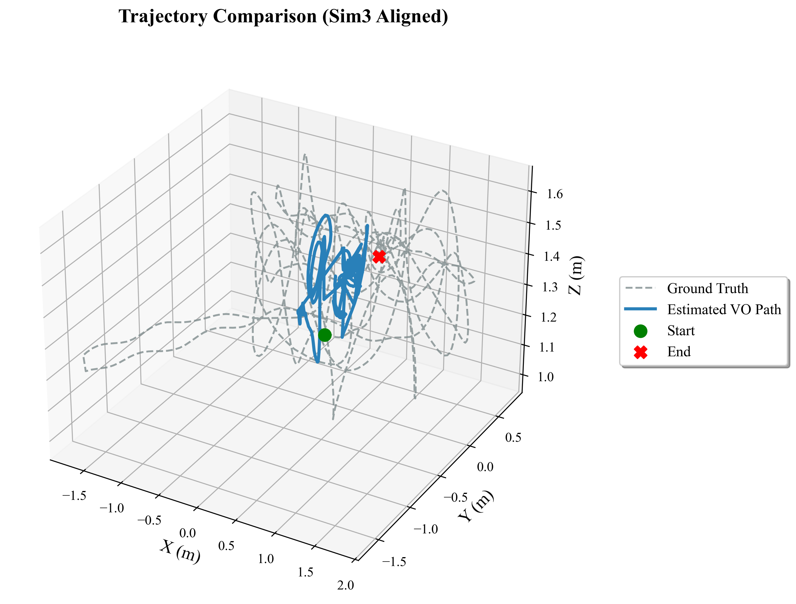 | 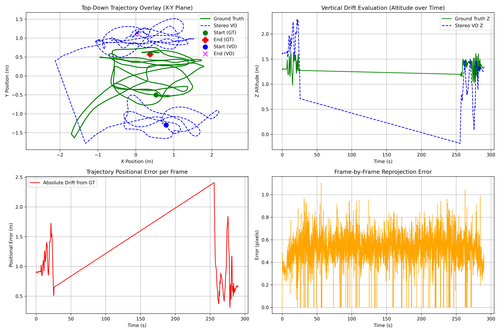 |
| **Outdoor5** | 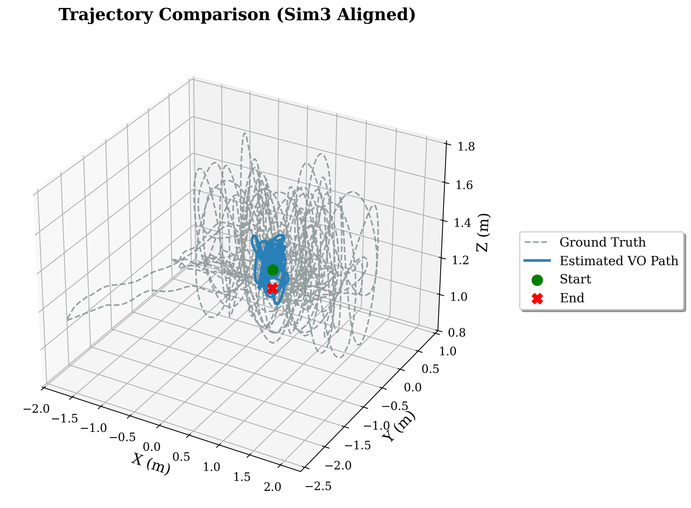 | 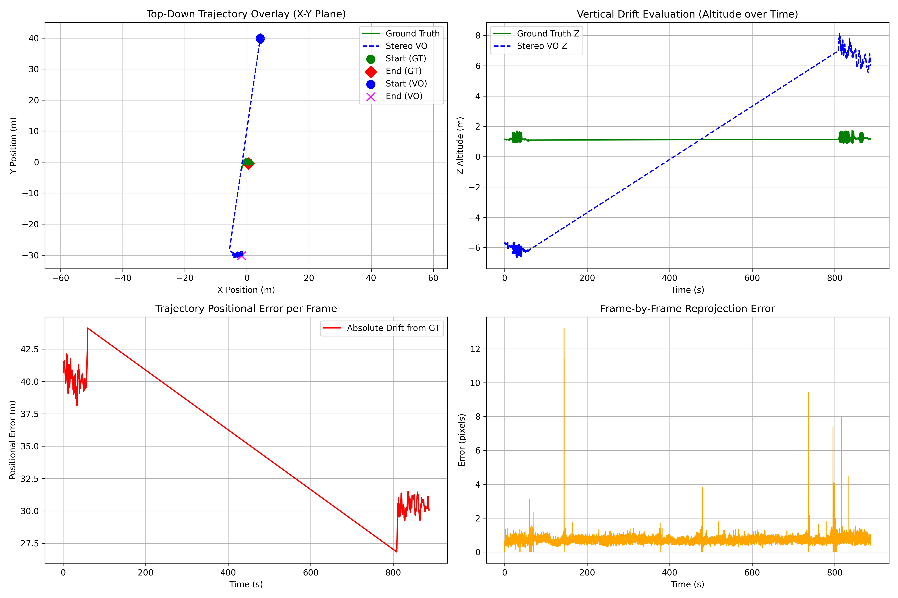 |

### Pipeline-II: ORB-Based Visual Odometry

| Dataset | Monocular VO | Stereo VO |
| :--- | :---: | :---: |
| **Room2** | 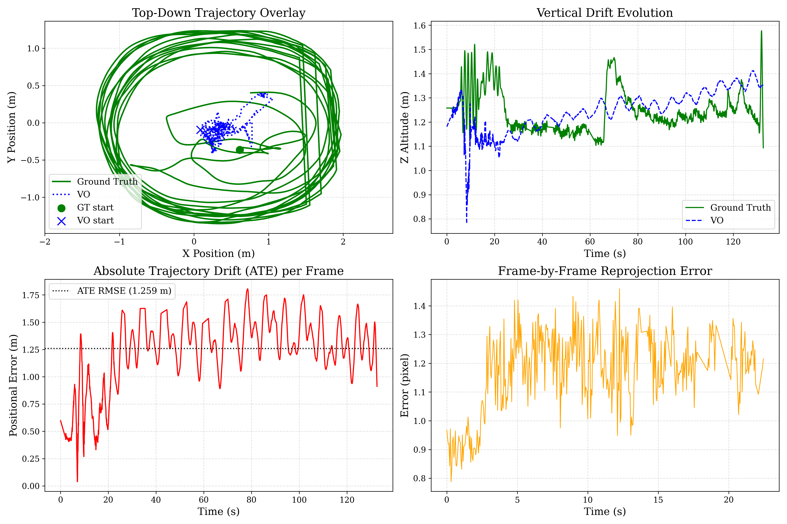 | 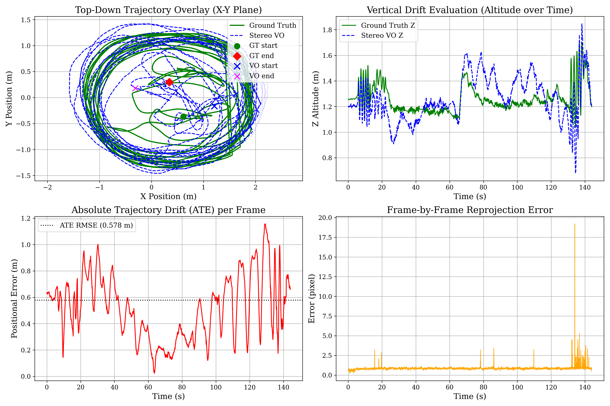 |
| **Corridor3** | 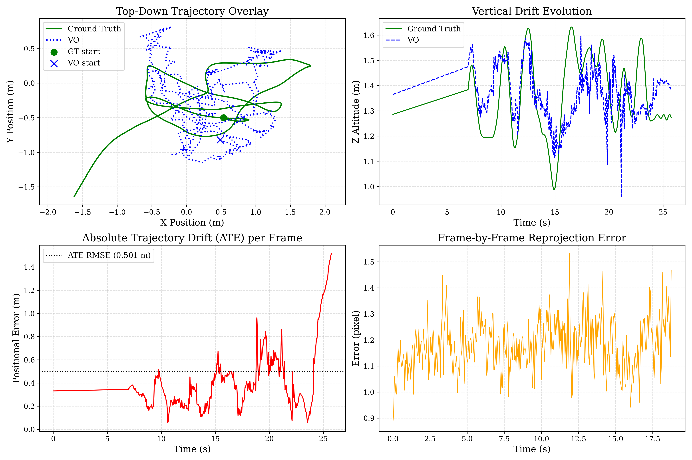 | 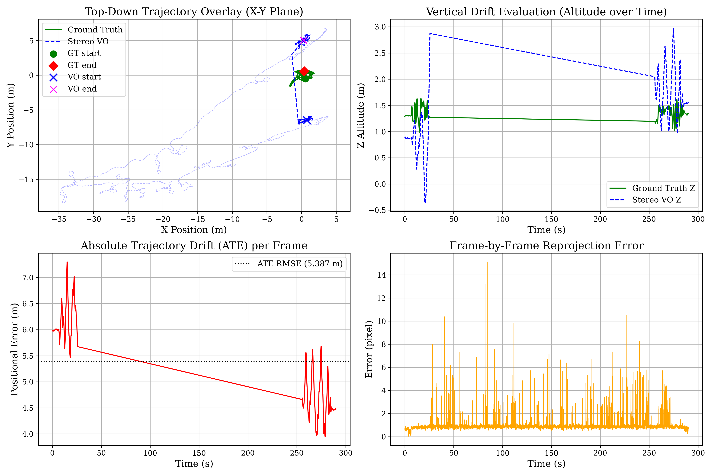 |
| **Outdoor5** | 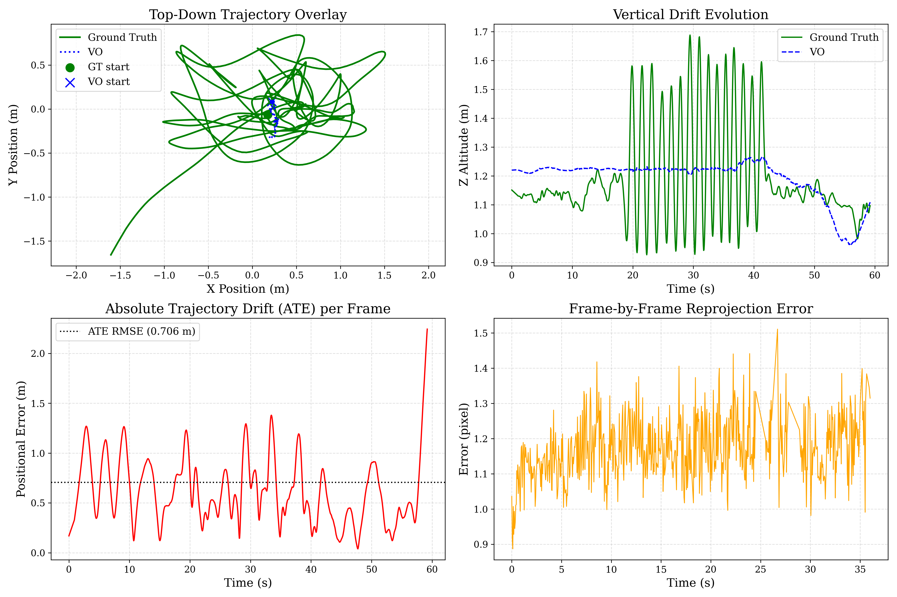 | 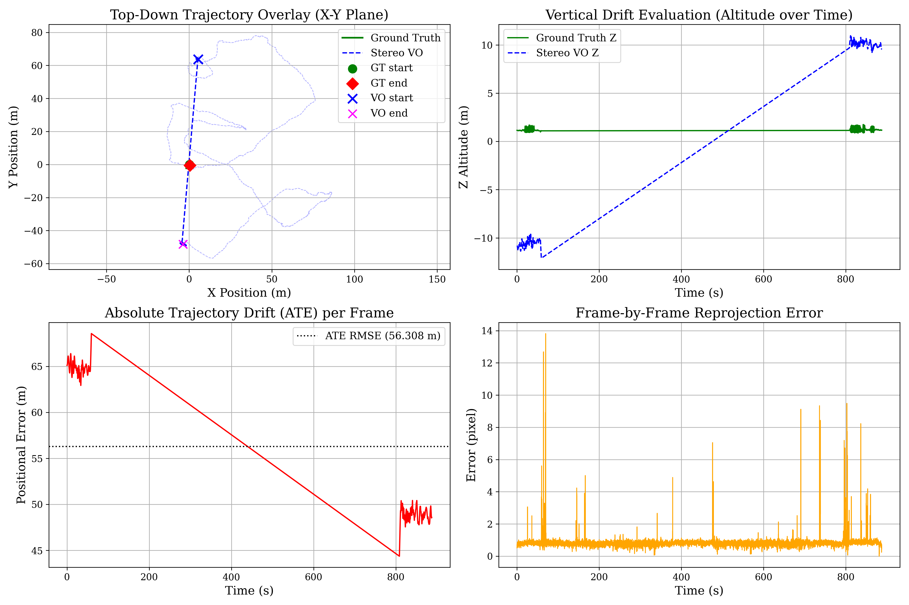 |

  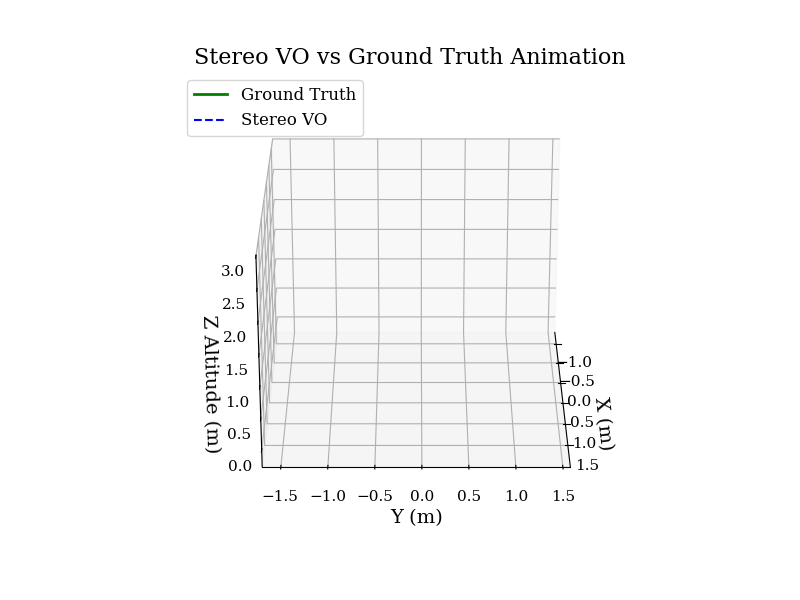

------
Below are the screen recordings showing the real-time tracking performance, feature bucketing, and trajectory maps across the indoor and outdoor datasets.
### Pipeline-I: KLT Tracking
### Room2 Stereo VO Sequence

  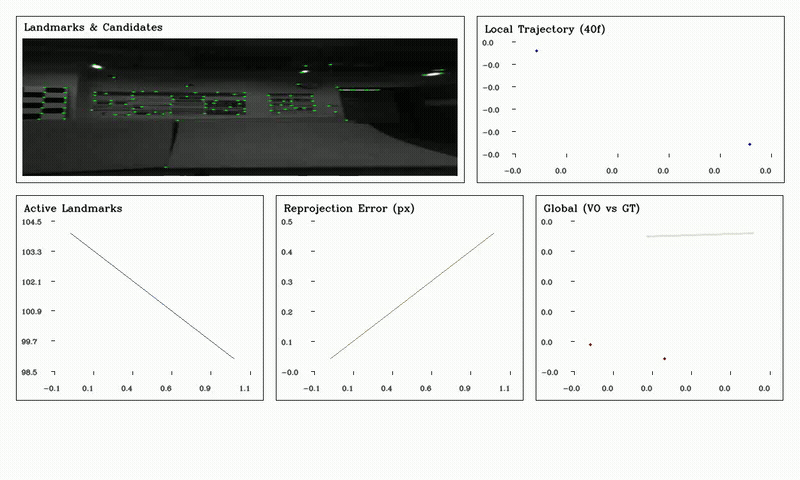

### Outdoors5 STEREO VO Sequence

  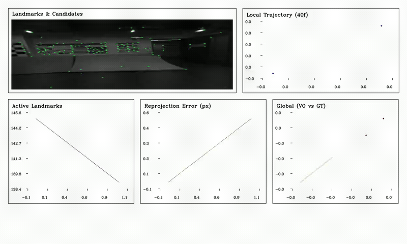

------

### Pipeline-II: ORB-Based Visual Odometry

### Room2 Stereo VO Sequence

  

### Outdoors5 STEREO VO Sequence

  

------

## ⚖️ Strengths and Limitations

| Pipeline | Strengths | Limitations |
| :--- | :--- | :--- |
| **Monocular VO** | • Low computational cost and fast runtime    • Requires only a single camera    • Can estimate depth using temporal triangulation | • No absolute metric scale    • Accumulates scale drift over time    • Tracking failure in low-texture scenes    • Essential matrix becomes unstable during pure rotation |
| **Stereo VO** | • Direct metric depth from stereo disparity    • Reduced trajectory drift    • Improved tracking robustness    • Better long-term trajectory stability | • Higher computational overhead    • Limited reliable depth range    • Noisy disparity near occlusions/boundaries    • Still affected by long-term drift |

## 🔄 Pipeline Architecture Comparison (ORB vs. KLT)

| Aspect | ORB Pipeline | KLT Pipeline |
| :--- | :--- | :--- |
| Feature Extraction | FAST corners + BRIEF descriptors | Shi–Tomasi corners + sub-pixel refinement |
| Tracking Method | Descriptor matching using Hamming distance | Pyramidal Lucas–Kanade optical flow |
| Filtering Strategy | Lowe ratio test + cross-checking | Forward–backward error validation |
| Motion Handling | Better for sudden/large motion | Better for smooth continuous motion |
| Relocalization | Supports descriptor-based relocalization | Relies on temporal continuity |
| Precision | Robust but lower local precision | High sub-pixel tracking accuracy |
| Computation Cost | Higher descriptor matching overhead | Lightweight but requires re-seeding |
| Main Weakness | Computationally expensive | Sensitive to sudden motion loss |

------

## 📊 Dataset Evaluation Summary

From the quantitative results, **Pipeline-I using KLT tracking performs better overall than Pipeline-II using ORB features**. In the Room2 dataset, Pipeline-I achieves lower trajectory errors in both monocular and stereo modes. For example, the stereo ATE is reduced from **0.579 m in Pipeline-II** to **0.2697 m in Pipeline-I**, and the stereo RPE decreases from **0.232 m to 0.0181 m**.

Pipeline-I also shows better runtime performance. The monocular version runs at **41.25 Hz on Room2**, compared to **9.98 Hz** for Pipeline-II. Similarly, the stereo version of Pipeline-I is faster across all datasets.

Although Pipeline-II has fewer tracking recoveries in the monocular case, Pipeline-I produces more accurate and stable trajectories with lower drift, lower pose error, and faster processing speed. This shows that the KLT-based approach is more suitable for this dataset because it provides efficient frame-to-frame feature tracking and maintains better temporal consistency between consecutive frames.

The pipeline was validated against three distinct sequences from the **TUM Visual-Inertial (TUM-VI)** benchmark (recorded at 20 Hz in 16-bit HDR):

| Sequence | Environment Type | Primary Challenge | Stereo Impact |
| :--- | :--- | :--- | :--- |
| **Room 2** | Indoor, Feature-Dense | High-speed dynamics | ATE reduced by 56%; tracking failures cut to 0. |
| **Corridor 3** | Narrow Hallway | Low texture, repeating patterns | Drastically stabilized tracking; bounded local optimization. |
| **Outdoor 5** | Large-Scale Mixed | Far-field sub-pixel disparity | Eradicated reinitialization loops; highlights long-range degradation. |

> **Note:** For specific hyperparameter setups per sequence (such as adaptive KLT window sizes, Huber loss scaling thresholds, and custom depth ceilings), refer to the configuration matrices inside the project documentation.

